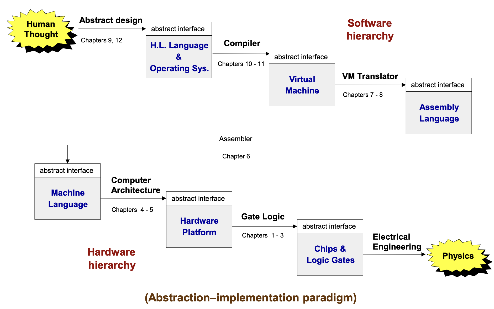

# Nand to Tetris Golang Implementation
Visit the Nand2Tetris website: http://nand2tetris.org/

## Overview

The Nand to Tetris course explores key computer science concepts including operating systems, compilers, virtual machines, assemblers, and logic gates. This implementation is built in Go.


*<span align="center">The course overview picture from Nand to Tetris</span>*

## 1. Assembler Part

The Assembler translates assembly language code (`*.asm`) into machine code (`*.hack`).

For further reading, check out these articles:

- English: [Medium Article](https://medium.com/@yohata/understanding-computer-architecture-through-nand-to-tetris-implementing-an-assembler-in-go-df515e19a974)
- Japanese: [Zenn Article](https://zenn.dev/tacoms/articles/1a8e9e1bc81d68)

### How to Run the Assembler Example:

How to run assembler on the example:

```sh
cd ./assembler
go run . ../examples/Pong/Pong.asm
```

## 2. VM Translator part

The VM Translator converts Virtual Machine code (`*.vm`) into assembly code (`*.asm`).

### How to Run the VM Translator Example:

```sh
cd ./vm
go run . ../examples/Pong
```

## 3. Compiler part

The Compiler converts code written in the Jack language (`*.jack`) into VM code (`*.vm`). The Jack language is a straightforward programming language developed by the creators of Nand to Tetris.

### How to Compile an Example Jack File:

```sh
cd ./compiler
go run . ../examples/Pong
```

Note: The current version of the compiler does not implement operator precedence as this feature is not covered in the Nand to Tetris course. I may add this feature later when I have more time.
